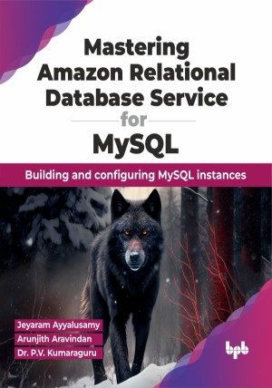

# Mastering Amazon Relational Database Service for MySQL

Toolkit for unlocking the power of Amazon RDS and propelling businesses toward success in the digital age
This is the repository for [Mastering Amazon Relational Database Service for MySQL
](https://bpbonline.com/products/mastering-amazon-relational-database-service-for-mysql?variant=43195509113032),published by BPB Publications.

## About the Book
This book is a valuable resource as a practical guide for professionals involved in managing Amazon Relational Database Service (RDS) instances. The book covers the fundamentals of Amazon RDS, configuration best practices, and optimizing performance. With MySQL databases, it explores essential components, AWS Regions, and Availability Zones.

Readers will benefit from the detailed discussions on managing and maintaining Amazon RDS MySQL instances, covering topics like stopping and starting DB instances, optimizing settings, handling maintenance updates, and understanding the nuances of reboots. The book emphasizes security considerations and provides a comprehensive guide to storage management, encryption options, backup strategies, and cost optimization.
The later chapters delve into advanced topics such as creating and connecting to MySQL databases on Amazon RDS, managing Multi-AZ MySQL DB clusters, and upgrading AWS RDS MySQL. The book also covers comprehensive monitoring techniques, tools, and insights, offering a thorough exploration of CloudWatch metrics, alarms, and event notifications. 

Throughout the book, best practices, common issues, and troubleshooting tips are provided, making it an indispensable companion for database administrators navigating the complexities of Amazon RDS for MySQL.

## What You Will Learn
• The fundamentals of Amazon RDS and how it simplifies the management of MySQL databases.

• How to set up, configure, and deploy MySQL instances on Amazon RDS.

• Best practices for designing highly available and scalable database architectures.

• Performance optimization techniques to ensure your MySQL databases run efficiently on Amazon RDS.

• Advanced topics such as replication, security, monitoring, and troubleshooting.
